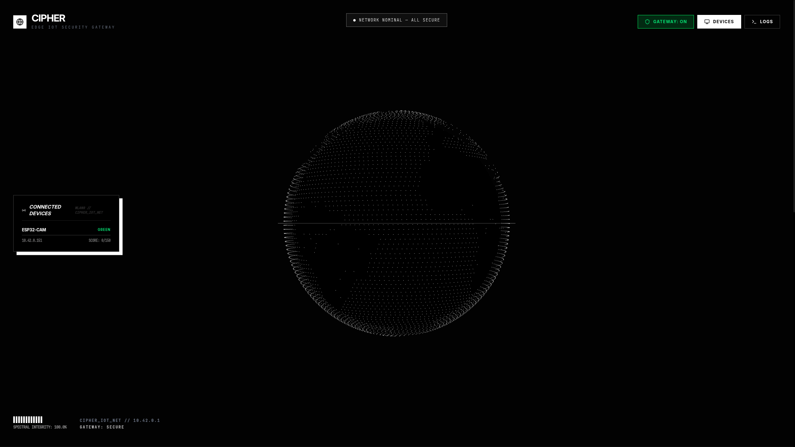
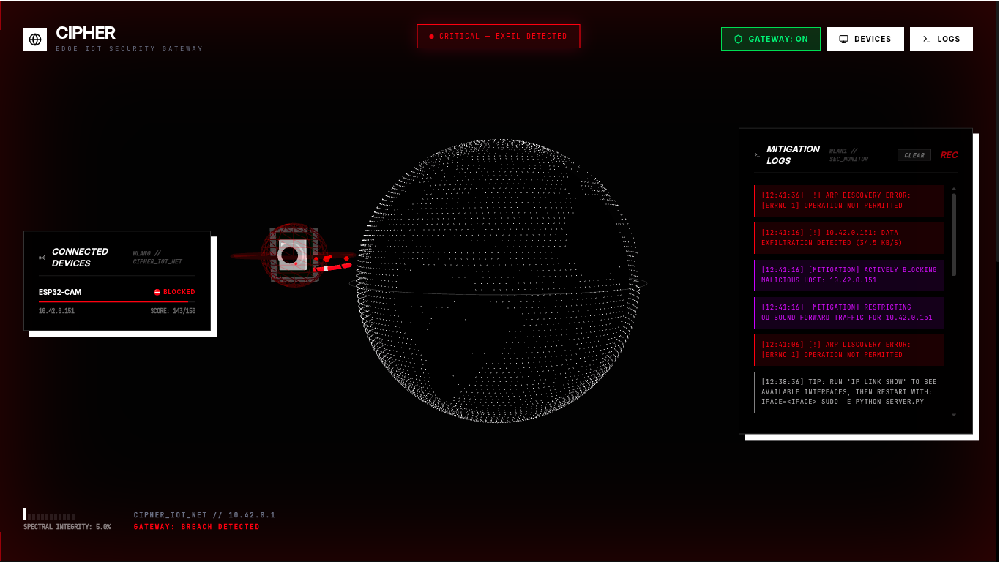
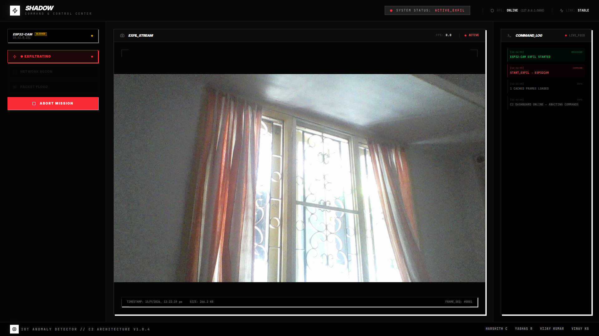
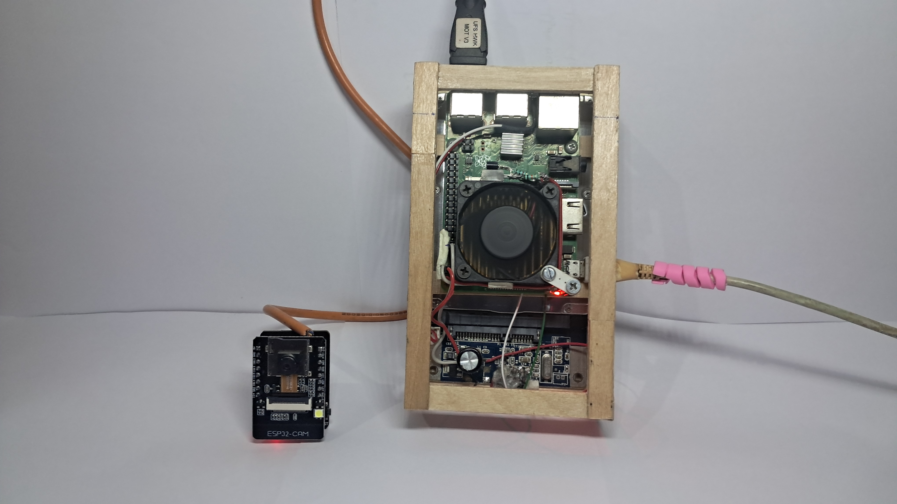

# CIPHER: Edge-AI IoT Security & Threat Response

[](./LICENSE)
[](https://www.raspberrypi.org/)
[](https://www.espressif.com/en/products/socs/esp32)
[](https://cipher-demo.netlify.app/)

**Cipher** is a live, end-to-end IoT security demonstration platform. It demonstrates how a low-cost edge gateway (Raspberry Pi) can detect, score, and mitigate malicious IoT behavior in real-time without relying on cloud-based AI.

---

## 🌐 Live Preview

> **Try the interactive dashboard demo — no hardware required.**
> 
> **[https://cipher-demo.netlify.app/](https://cipher-demo.netlify.app/)**
> 
> The demo simulates a real attack scenario: an ESP32-CAM device on the network begins exfiltrating data to a cloud C2 server. Click **"Simulate Attack"** to watch the threat detection and auto-mitigation play out in real-time on the 3D globe.

---

## 📸 System Demonstration & Screenshots

### 1. Defender Dashboard — Nominal Network State
Real-time 3D cybernetic monitoring on the Raspberry Pi edge gateway. The network is nominal with an authenticated **ESP32-CAM** device connected (`10.42.0.151`, Threat Score `0/150`).


### 2. Defender Dashboard — Attack Detection & Auto-Mitigation
Under an active image exfiltration attack, the edge rule engine detects elevated bandwidth, raises a `CRITICAL — EXFIL DETECTED` alert, visualizes threat particles on the 3D globe, and automatically blocks the device via dynamic iptables firewall rules.


### 3. Attacker Dashboard — Cloud C2 Exfiltration Feed
The SHADOW Command & Control console manages attack triggers and renders live exfiltrated camera frames with real-time HUD telemetry (latency, frame sequencing, payload size, and audit logs).


### 4. Physical Hardware Testbed & Enclosure
Bench-tested hardware prototype showcasing the **Raspberry Pi 3B+ Edge Gateway** (housed in a custom wooden enclosure with an active cooling fan, interface bus, and Ethernet uplink) alongside the weaponized **AI-Thinker ESP32-CAM** node.


---

## 🏗️ System Architecture

1.  **Edge Gateway (Raspberry Pi 3B+):** The "Defender". Sniffs traffic on the `10.42.0.0/24` subnet, calculates dynamic packet entropy threat scores, and enforces sub-second kernel `iptables` quarantine without relying on cloud AI.
2.  **Cybersecurity Dashboard (React/Three.js):** The "Command Center". Real-time 3D WebGL globe telemetry with attack arcs, threat scoring HUD, and live quarantine status.
3.  **Cloud C2 Server (Node.js):** The "Attacker". Triggers attack vectors and receives exfiltrated camera frames.
4.  **Compromised IoT Nodes (ESP32-CAM):** The "Targets". Weaponized edge device executing data exfiltration, Mirai UDP flood, and subnet reconnaissance on command.

---

## 🔌 Hardware Bill of Materials (BOM)

Cipher is engineered for high-performance edge detection on affordable, university-friendly hardware (~₹6,730 total bench-tested BOM, as shown in the [Physical Hardware Testbed](#4-physical-hardware-testbed--enclosure)):

| Component | Specification | Role | Approx Rate (INR) |
| :--- | :--- | :--- | :--- |
| **Edge Gateway** | Raspberry Pi 3 Model B+ (1GB RAM) | Runs Python Scapy sniffer daemon, iptables quarantine & 3D telemetry server | ₹4,600 |
| **Malicious IoT Node** | AI-Thinker ESP32-CAM (OV2640 2MP) | Emulates rogue IoT device executing exfil, UDP flood & port scan | ₹550 |
| **Serial Programmer** | FTDI FT232RL USB-to-UART TTL | Flashing C++ malware emulation firmware to ESP32-CAM | ₹190 |
| **Storage** | SanDisk Extreme 32GB Class 10 U3 MicroSD | Raspberry Pi OS Lite & Cipher platform environment | ₹450 |
| **Gateway Power** | Official 5V 2.5A Micro-USB Power Adapter | Stable power delivery to prevent gateway undervoltage | ₹480 |
| **Node Power** | 5V 2A Micro-USB Power Supply | Powers ESP32-CAM node independently during live demos | ₹220 |
| **Prototyping Board** | 830-Point Solderless Breadboard + Power Module | Bench wire routing & common ground bus | ₹160 |
| **Wiring Harness** | 40-Pin Female-to-Female & Male-to-Female Jumpers | Connecting FTDI and breadboard headers | ₹80 |

*Hardware kit, guide-approved IEEE synopsis, thesis reports, and viva prep decks available on [buildproject.in](https://buildproject.in/projects/cipher).*

---

## 🚀 Quick Start Guide

### 0. Environment Setup
Copy the environment template and customize as needed:
```bash
cp .env.example .env
```

### 1. Cloud C2 Server (The Attacker)
```bash
./attack.sh
```
*Note: This will automatically start the C2 server and print the public URL (e.g., `http://YOUR_SERVER_IP:5000`).*

### 2. Edge Gateway & Dashboard (The Defender)
```bash
./defend.sh
```
*Note: This will automatically start the gateway, enable routing/NAT, and print your public ngrok URL.*

### 3. ESP32 Firmware
Flash the firmware to your ESP32-CAM using Arduino IDE:
- File: `esp32cam/esp32cam.ino`
- Match `C2_HOST` with your `CLOUD_C2_URL` IP/domain configured in `.env`.

---

## 🚀 Attack Scenarios
- **Data Exfiltration:** ESP32-CAM steals images and uploads them to the Cloud C2.
- **DDoS (UDP Flood):** IoT nodes weaponized to flood a target server.
- **Local Reconnaissance:** Devices scanning the local network for vulnerabilities.

---

## 🛠️ Tech Stack
- **Frontend:** React 19, Three.js, Framer Motion, Tailwind CSS 4
- **Backend:** Node.js (C2), Python/Scapy (Gateway)
- **Firmware:** C++ (Arduino)

---

## 📄 License
This project is licensed under the **MIT License**. See the [LICENSE](./LICENSE) file for details.

---
*Built for the future of network security visualization.*
